# Architecture — VaultKey (working name)

An offline, encrypted password locker with a private input keyboard that suggests saved credentials inline while typing.

## 1. Two ways to detect "which login this is" — pick a hybrid

A custom keyboard by itself can only see two things through Android's `EditorInfo`: the **field type** (password / username / email) and the **package name of the app in focus**. That's enough for native apps, but **not enough for browsers** — Chrome, Firefox, etc. all report the same package name no matter which website is loaded, so a pure-IME approach can't tell `github.com` apart from `gmail.com` inside the same browser tab.

Android already solved this with the **Autofill Framework** (API 26+) and **inline suggestions** (API 30+), which let a registered `AutofillService` receive the actual structured view data (including web-domain hints from properly-marked-up login forms) and hand suggestions back to the keyboard's suggestion strip. This is the same mechanism Bitwarden, 1Password, etc. use.

**Recommended architecture: run both, offline, from one encrypted store.**

| Surface | Mechanism | Handles |
|---|---|---|
| Native apps | Custom IME + `packageName` match | Instagram app, banking app, etc. |
| Browsers / web forms | `AutofillService` + inline suggestions rendered inside the same keyboard | github.com, any website, regardless of browser |
| Everywhere | Same encrypted Room database, same matching engine | Single source of truth |

This means the "app" is really two Android components sharing one data layer — not a single Activity.

## 2. Component diagram

```mermaid
flowchart TB
    subgraph UI["Vault App (Activity/Compose UI)"]
        Lock["Unlock screen (master password / biometric)"]
        List["Vault list / search"]
        Edit["Add / edit credential"]
        Settings["Settings: enable keyboard, enable autofill service"]
    end

    subgraph IME["Keyboard module (fork of HeliBoard)"]
        Typing["Typing surface (unmodified fork)"]
        SuggestStrip["Suggestion strip"]
        CredInjector["Credential suggestion injector"]
    end

    subgraph Autofill["VaultAutofillService"]
        Parser["AssistStructure parser (web-domain + field hints)"]
        InlineResp["Inline suggestion response builder"]
    end

    subgraph Core["Vault Engine (shared, no HeliBoard code)"]
        Crypto["CryptoManager (Android Keystore + AES-256-GCM)"]
        DB["Encrypted Room DB (SQLCipher)"]
        Matcher["Matching engine (packageName / domain -> credential)"]
    end

    Lock --> Crypto
    List --> DB
    Edit --> DB
    Settings -.enables.-> IME
    Settings -.enables.-> Autofill

    Typing --> CredInjector
    CredInjector --> Matcher
    Parser --> Matcher
    Matcher --> DB
    Matcher --> Crypto
    InlineResp --> SuggestStrip
    CredInjector --> SuggestStrip
```



## 3. Data model

```
Vault (1) ── encrypted with ── MasterKey (Keystore-wrapped)
   └── Credential
         id            UUID
         label         "GitHub"                (user-editable display name)
         matchType     PACKAGE_NAME | WEB_DOMAIN
         matchValue    "com.github.android"    or   "github.com"
         username      encrypted blob
         password      encrypted blob
         notes         encrypted blob (optional)
         createdAt / updatedAt / lastUsedAt
```

- One `Credential` can have **multiple match values** (e.g. both the GitHub Android app's package name and `github.com`), stored as a small child table `CredentialMatch(credentialId, matchType, matchValue)` — this is what lets one saved login autofill in both the app and the mobile browser.
- Nothing is stored in `SharedPreferences` in plaintext, ever — see threat model below.

## 4. Encryption design

- **Master key**: generated inside Android Keystore (`AndroidKeyStore` provider), `AES-256`, hardware-backed (TEE/StrongBox) when the device supports it. The raw key material never leaves the secure element and is not exportable.
- **Database**: Room on top of **SQLCipher** (`net.zetetic:sqlcipher-android`), so the entire SQLite file is encrypted at rest, not just individual fields — protects metadata (labels, match values, timestamps) too, not only passwords.
- **Unlock flow**: a user-chosen master password (run through a slow KDF — Argon2id or PBKDF2 with a high iteration count) derives a passphrase-wrapping key; that key unwraps the Keystore-protected database key. Optionally, `BiometricPrompt` tied to a `CryptoObject` can be layered on top so fingerprint/face unlock is also hardware-gated, not just a UI convenience check.
- **In memory**: decrypted credential values are held only as long as needed to render/insert them, then cleared; avoid `String` for secrets where practical (use `CharArray`/`ByteArray`, zero them after use) since `String` is immutable and lingers in memory until GC.
- **No network permission anywhere in the keyboard or autofill module** — this is both a privacy commitment and a concrete, auditable claim (a reviewer/user can check the manifest and confirm there's no `INTERNET` permission at all).
- **Backups**: exclude the vault database from Android Auto Backup (`android:allowBackup="false"` or explicit `backup_rules.xml` exclusion) so an unencrypted cloud backup can't become the weak link.

## 5. Threat model (what this design defends against, and what it doesn't)

**Defends against:**
- Network exfiltration (no network access from the sensitive components at all).
- Casual device access (someone picking up an unlocked... no, a *locked* phone and browsing files — DB is encrypted at rest).
- Basic reverse engineering of the APK to find a hardcoded key (there isn't one; key lives in Keystore).

**Does not fully defend against (be upfront about this with users):**
- A **rooted device** or a device with a compromised OS: Keystore-backed keys resist extraction far better than software-only storage, but a fully compromised OS can still abuse the key *while it's in use* (this is a known, industry-wide limitation, not specific to this app).
- **Malicious accessibility services** on the same device (a separate, unrelated app with Accessibility permission can, in principle, read what's on screen). This app should avoid requesting Accessibility permission itself and should document the risk of *other* apps having it.
- **Shoulder surfing / screen recording** while a suggestion chip is shown — mitigate with `FLAG_SECURE` on sensitive screens and by masking password values until explicitly revealed.

## 6. Module layout (maps directly to source folders)

```
vaultkey/
├── app/                     # Vault UI: unlock, list, add/edit, settings (no HeliBoard code)
├── vault-core/              # CryptoManager, Room+SQLCipher DB, Matcher — GPL-free, reusable
├── keyboard/                # Fork of HeliBoard + CredInjector glue (GPL-3.0 boundary)
└── autofill/                # VaultAutofillService (depends on vault-core only)
```

`keyboard` and `autofill` both depend on `vault-core`, but `vault-core` depends on neither — this is what keeps the GPL-3.0 obligation scoped to the keyboard module only, per the licensing note in the research doc.

## 7. Onboarding flow (what the user actually has to do)

1. Set a master password (or passphrase) → generates the Keystore-wrapped DB key.
2. Optional: enable biometric unlock.
3. **Enable "VaultKey Keyboard"** under Settings → System → Languages & input → On-screen keyboard → set as the default/active keyboard.
4. **Enable "VaultKey" as the Autofill service** under Settings → System → Languages & input → Autofill service (this is what makes browser/web-form matching work; the keyboard alone can't).
5. From then on: filling a login form anywhere shows a suggestion chip inline above the keys; saving a new login prompts a "Save to VaultKey?" banner the first time a not-yet-known form is submitted.
