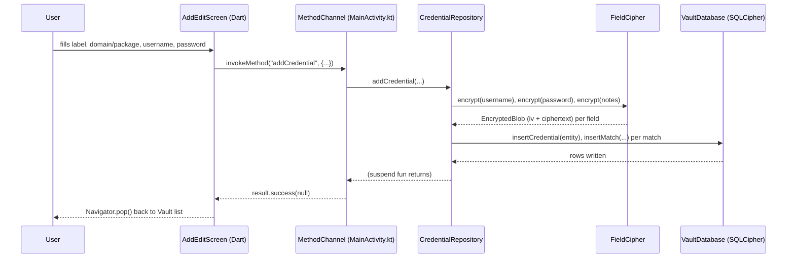
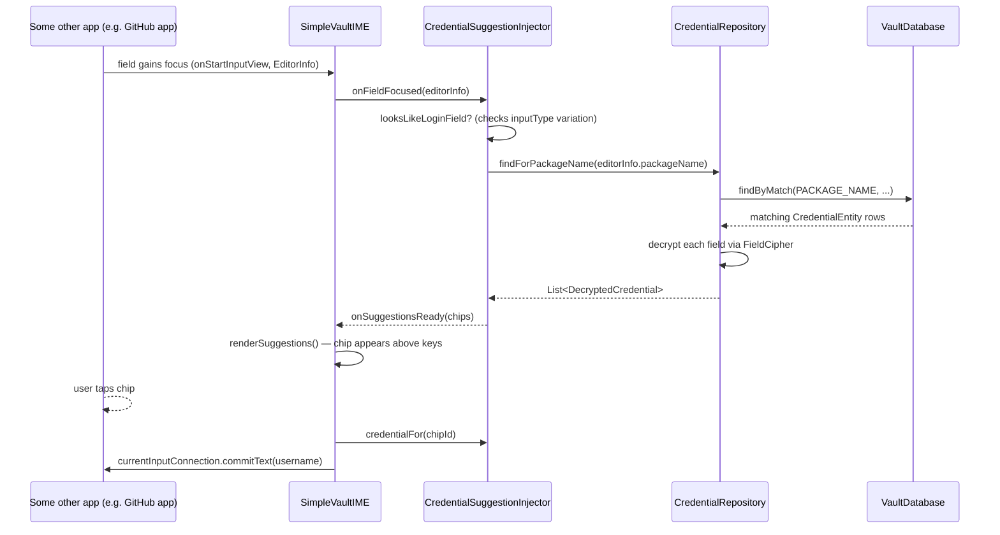
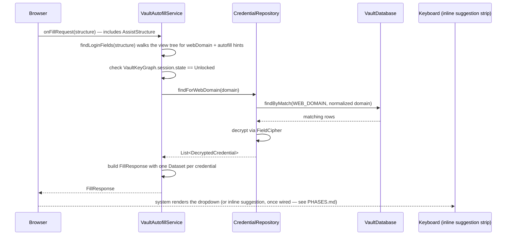
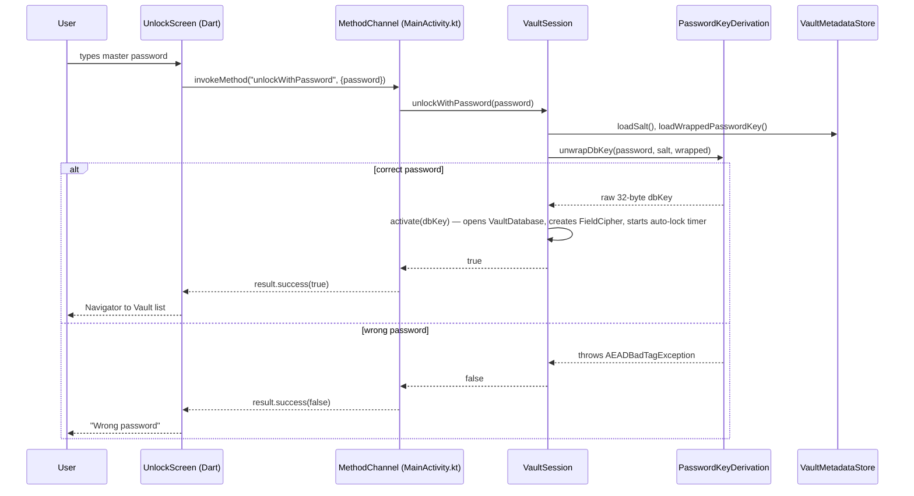
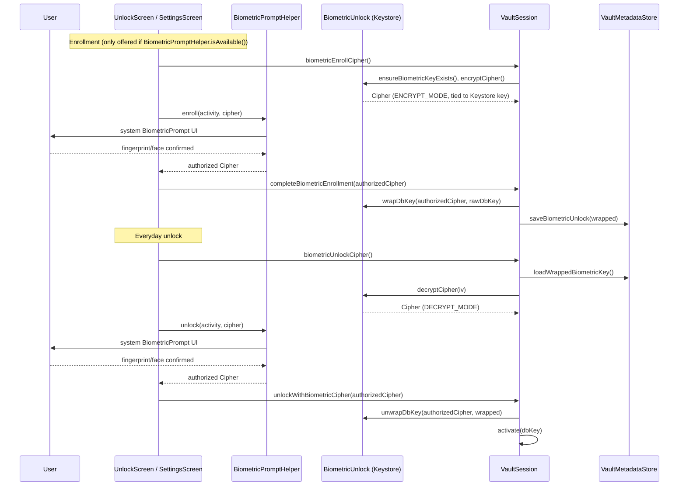

# Data Flow Diagrams

Every flow below starts and ends on-device — there is no network hop in any
of these diagrams, anywhere, which is the point.

## 1. Saving a new credential

Every other flow below (native-app suggestion, browser autofill, password
unlock, biometric unlock) is untouched by the Flutter migration — none of
them go through Dart at all, since the keyboard and autofill service are
still fully native and never talk to Flutter or `MainActivity`.

## 2. Suggestion popup inside a native app

Note: this path only ever sees the **package name** — see Data Flow #3 for
why website matching inside a browser needs the Autofill path instead.

## 3. Suggestion inside a browser (website matching)

## 4. Unlock with master password

## 5. Biometric enrollment + unlock

## What never appears in any of these diagrams

A network call. Search every sequence above for an arrow leaving the
device — there isn't one. That's the entire point of the "no INTERNET
permission anywhere" design decision in `02-architecture.md`.
