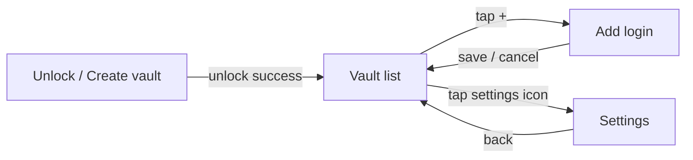

# UX / UI Design

This is the written companion to `03-ui-ux-mockup.html` (the visual mockup) —
covering the screen inventory, component list, states, accessibility, and a
mobile-optimization review. **Updated for the Flutter migration**: the UI
described below is now `lib/` (Dart), not the archived Compose version in
`legacy_compose_ui/app-compose-reference/` — screen behavior is equivalent,
but the file references below point at the current Dart implementation.

## Screen inventory

| # | Screen | File | Matches mockup |
|---|---|---|---|
| 1 | Unlock / create vault | `lib/screens/unlock_screen.dart` | SCR.01 |
| 2 | Vault list + search + detail dialog | `lib/screens/vault_list_screen.dart` | SCR.02 |
| 3 | Suggestion popup (in-keyboard, not a screen) | `android/keyboard/.../SimpleVaultIME.kt` — **restyled this session**, see below | SCR.03 |
| 4 | Add login | `lib/screens/add_edit_screen.dart` | SCR.04 — same divergence as before: two explicit optional match fields (website domain, app package) rather than guessing from one field. |
| 5 | Settings | `lib/screens/settings_screen.dart` | SCR.05 |

`VaultListScreen` now includes a working **view-credential dialog**
(tap a row → username + masked/revealable password + notes) — this closes
the "tapping a row does nothing" gap noted in the pre-Flutter version of
this document. There's still no separate **edit** flow (only add + view).

## Keyboard restyle (this session)

Direct feedback was that the keyboard "looked worst, not like Google
keyboard." `SimpleVaultIME` was rebuilt with:
- Rounded key backgrounds with a real pressed-state color (via
  `GradientDrawable` + `StateListDrawable`, no XML drawables needed)
- 48dp key height (previously 46dp — this also closes the touch-target gap
  noted below in the original review)
- A staggered middle row (`a s d f g h j k l` inset from the edges, matching
  real keyboards instead of a flush grid)
- Haptic feedback on every key press
- A language label on the spacebar ("English (US)"), matching Gboard's convention
- A pill-shaped, icon-prefixed suggestion chip instead of a flat rectangle

Still a Phase 2a proof-of-concept for the suggestion mechanism, not
production typing (no autocorrect/gestures/other languages) — see
`keyboard/FORK_NOTES.md`.

## Navigation flow

## Component inventory

Reused across screens, all Material 3 out of the box (no custom component
library was built — deliberate, given the small screen count):

- `OutlinedTextField` — every text input (master password, label, domain,
  package, username, password, notes)
- `Button` (filled) — primary actions: Unlock/Create vault, Save to Vault
- `TextButton` — secondary action: "Use Face/Fingerprint instead"
- `ListItem` — vault rows, all three Settings rows
- `Switch` — the biometric-unlock toggle
- `FloatingActionButton` — add-credential entry point
- `TopAppBar` — every screen's header

Two components exist **only** inside the keyboard module, built from raw
`View`s rather than Compose (the keyboard surface is a separate rendering
world from the app's Compose UI):

- The QWERTY key grid (`SimpleVaultIME.keyRow`)
- The credential suggestion chip (`SimpleVaultIME.renderSuggestions`) — a
  `TextView` styled to look like a pill/chip, matching the blue accent color
  from the mockup

## Design tokens

Centralized in `app/src/main/java/com/vaultkey/app/ui/theme/Theme.kt` so the
built app and `03-ui-ux-mockup.html` can't silently drift apart:

| Token | Value | Used for |
|---|---|---|
| Ink | `#14151A` | Headers, dark surfaces, keyboard background accents |
| Paper | `#ECEAE6` | Light background |
| Paper2 | `#E2E0DB` | Secondary light surface |
| Accent Blue | `#2F4EEA` | Primary actions, suggestion chips, focused-field outline |
| Muted | `#87868C` | Secondary text |
| Line | `#D3D1CB` | Hairline dividers |

**Gap:** the mockup's display typeface (a geometric sans in the "CVAT
Digest"-style headline) is not yet bundled as an actual font resource — 
`Type.kt` uses the platform default font with matching weights/sizes, not
the real typeface. Add `Space Grotesk`/`Inter` as `res/font/` files and
reference them in `VaultKeyTypography` to close this gap.

## States

| State | Where handled | How |
|---|---|---|
| First run (no vault yet) | `UnlockScreen` | `VaultState.Uninitialized` branch — shows password + confirm-password fields |
| Wrong master password | `UnlockScreen` | Inline error text below the password field |
| Empty vault (no credentials saved) | `VaultListScreen` | "No saved logins yet. Tap + to add your first one." |
| No search results | `VaultListScreen` | "No matches for "{query}"" |
| Missing required fields on Add login | `AddEditCredentialScreen` | Inline error text above the Save button |
| Biometric hardware/enrollment unavailable | `UnlockScreen`, `SettingsScreen` | Checked via `BiometricPromptHelper.isAvailable()` before ever showing a biometric prompt — added this session after finding it was missing (see `PHASES.md`) |

**Gap:** there's no loading/spinner state anywhere — every repository call
is a quick local SQLCipher read, so this is a reasonable simplification for
now, but a very large vault (hundreds of entries) would benefit from a
loading indicator on `VaultListScreen`'s initial `LaunchedEffect` fetch.

## Accessibility

- All icon-only controls (`Icons.settings_outlined`, `Icons.add`,
  `Icons.visibility`) rely on Flutter's default semantics; Flutter's
  `IconButton` accepts a `tooltip` parameter that also feeds screen-reader
  labels, and none of the icon buttons in `lib/screens/` currently set one.
  **Should be explicitly audited** before shipping — flagging as a follow-up
  since the right copy is a product decision, not fixing silently.
- Password fields use `obscureText: true` — correct for privacy. Unlike the
  pre-Flutter version, `VaultListScreen`'s detail dialog now DOES have a
  reveal/hide toggle (the `Icons.visibility`/`visibility_off` button) — this
  closes the "no show-password toggle" gap noted previously, though only for
  viewing a saved credential, not for the add-login form's password field.
- Touch targets: the keyboard's `SimpleVaultIME` keys are now `48dp` tall
  (bumped from `46dp` in this session's restyle — see the note above) — at
  Android's recommended minimum, no longer just under it.

## Mobile-optimization review

What's already handled well:
- `FLAG_SECURE` was set on the old Compose `MainActivity` but was missed in
  the initial pass of this Flutter migration — caught during this same
  review and **re-added** to the new `MainActivity.onCreate()`. Worth
  mentioning here anyway since it's exactly the kind of thing worth
  double-checking after any activity-class rewrite.
- `ListView.builder` in `VaultListScreen` — correct choice for a potentially
  long list, avoids inflating every row up front (same reasoning as the old
  `LazyColumn`).
- The keyboard view is still built from lightweight native `View`s, not
  Flutter or Compose — correct call, unchanged by this migration, since
  `InputMethodService` input views need to be as lightweight/fast to
  inflate as possible and have no relationship to the app's UI framework.

What's not yet addressed:
- No landscape-orientation testing/consideration — the keyboard's key grid
  in particular would need different sizing in landscape (this is normal
  even for production keyboards, but worth flagging as untested here).
- No tablet/large-screen layout — `VaultListScreen`'s single-column list
  would look sparse on a tablet; not a priority for a phone-first password
  manager, but worth a conscious decision rather than a default.
- Dark mode: `theme.dart` only defines a light `ColorScheme` — the old
  Compose version at least had a `VaultKeyDarkColors` stub; that didn't
  carry over. Real gap, not a stylistic one, since Flutter defaults to
  following system dark mode unless a theme is explicit about it, so right
  (never adapts), so the in-app dark theme is really its own design pass
  that hasn't happened yet.

## Honest summary

Nothing in this document was verified by actually running the app — see the
compile-time caveat repeated throughout this project. This is a structural
and logical review (reading the Compose code against the mockup and against
Android UX conventions), not a QA pass on a running build. Treat the "Gap"
callouts above as the first punch list once the app actually runs on a
device or emulator.
