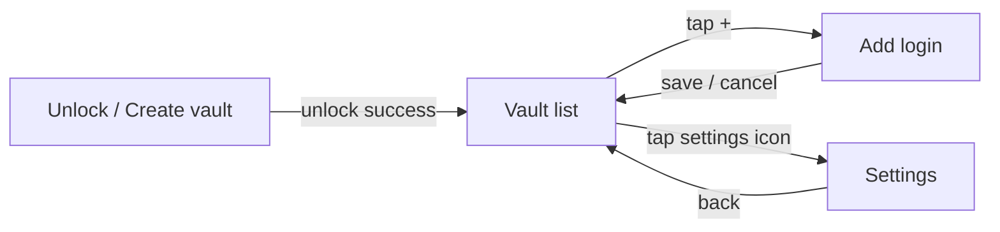

# UX / UI Design

This is the written companion to `03-ui-ux-mockup.html` (the visual mockup) —
covering the screen inventory, component list, states, accessibility, and a
mobile-optimization review of what was actually built in the `app` module's
Compose code. Where the built screens differ from the mockup, that's called
out explicitly rather than glossed over.

## Screen inventory

| # | Screen | Composable | Matches mockup |
|---|---|---|---|
| 1 | Unlock / create vault | `UnlockScreen` | SCR.01 |
| 2 | Vault list + search | `VaultListScreen` | SCR.02 |
| 3 | Suggestion popup (in-keyboard, not a screen) | `SimpleVaultIME.renderSuggestions()` | SCR.03 |
| 4 | Add login | `AddEditCredentialScreen` | SCR.04 — **diverges**: the mockup shows one "Matches" field; the built screen uses two explicit optional fields (website domain, app package) instead — see the file's own doc comment for why guessing the type from one field was rejected during the build. |
| 5 | Settings | `SettingsScreen` | SCR.05 |

There is currently no **edit/view existing credential** screen —
`VaultListScreen` lists credentials but tapping a row does nothing yet.
That's a real gap (below), not an intentional omission.

## Navigation flow

## Component inventory

Reused across screens, all Material 3 out of the box (no custom component
library was built — deliberate, given the small screen count):

- `OutlinedTextField` — every text input (master password, label, domain,
  package, username, password, notes)
- `Button` (filled) — primary actions: Unlock/Create vault, Save to Vault
- `TextButton` — secondary action: "Use Face/Fingerprint instead"
- `ListItem` — vault rows, all three Settings rows
- `Switch` — the biometric-unlock toggle
- `FloatingActionButton` — add-credential entry point
- `TopAppBar` — every screen's header

Two components exist **only** inside the keyboard module, built from raw
`View`s rather than Compose (the keyboard surface is a separate rendering
world from the app's Compose UI):

- The QWERTY key grid (`SimpleVaultIME.keyRow`)
- The credential suggestion chip (`SimpleVaultIME.renderSuggestions`) — a
  `TextView` styled to look like a pill/chip, matching the blue accent color
  from the mockup

## Design tokens

Centralized in `app/src/main/java/com/vaultkey/app/ui/theme/Theme.kt` so the
built app and `03-ui-ux-mockup.html` can't silently drift apart:

| Token | Value | Used for |
|---|---|---|
| Ink | `#14151A` | Headers, dark surfaces, keyboard background accents |
| Paper | `#ECEAE6` | Light background |
| Paper2 | `#E2E0DB` | Secondary light surface |
| Accent Blue | `#2F4EEA` | Primary actions, suggestion chips, focused-field outline |
| Muted | `#87868C` | Secondary text |
| Line | `#D3D1CB` | Hairline dividers |

**Gap:** the mockup's display typeface (a geometric sans in the "CVAT
Digest"-style headline) is not yet bundled as an actual font resource — 
`Type.kt` uses the platform default font with matching weights/sizes, not
the real typeface. Add `Space Grotesk`/`Inter` as `res/font/` files and
reference them in `VaultKeyTypography` to close this gap.

## States

| State | Where handled | How |
|---|---|---|
| First run (no vault yet) | `UnlockScreen` | `VaultState.Uninitialized` branch — shows password + confirm-password fields |
| Wrong master password | `UnlockScreen` | Inline error text below the password field |
| Empty vault (no credentials saved) | `VaultListScreen` | "No saved logins yet. Tap + to add your first one." |
| No search results | `VaultListScreen` | "No matches for "{query}"" |
| Missing required fields on Add login | `AddEditCredentialScreen` | Inline error text above the Save button |
| Biometric hardware/enrollment unavailable | `UnlockScreen`, `SettingsScreen` | Checked via `BiometricPromptHelper.isAvailable()` before ever showing a biometric prompt — added this session after finding it was missing (see `PHASES.md`) |

**Gap:** the vault list is a quick local SQLCipher read (now a reactive Room
`Flow` via `observeAll`, so it self-refreshes on add/remove), so it has no
spinner — reasonable for now, though a very large vault would benefit from a
loading state. `UnlockScreen` *does* show a "Please wait…" state, since its
PBKDF2 derivation now runs off the main thread.

## Accessibility

- All icon-only controls (`Icons.Filled.Add`, `Settings`, `Close`) currently
  rely on Compose's default `contentDescription` handling via the icon's
  semantic label where set, but **should be explicitly audited** — a couple
  of `IconButton`s don't pass an explicit `contentDescription` string
  resource, which TalkBack will read poorly. Flagging as a follow-up rather
  than fixing silently, since the right copy is a product decision.
- Password fields use `PasswordVisualTransformation()` — correct for privacy,
  but there's no "show password" toggle anywhere, which is a real usability
  gap for anyone visually confirming what they typed before saving.
- Touch targets: the keyboard's `SimpleVaultIME` keys are `46dp` tall — just
  under Android's 48dp recommended minimum touch target. Worth bumping to
  48dp when this becomes a real (non-PoC) keyboard, though the letter keys'
  width still comfortably exceeds the minimum in the other dimension.

## Mobile-optimization review

What's already handled well:
- `FLAG_SECURE` on `MainActivity` — excludes the app from recents thumbnails
  and screen recording, directly relevant on a screen showing credentials.
- `LazyColumn` in `VaultListScreen` — correct choice for a potentially long
  list, avoids inflating every row up front.
- The keyboard view is built from lightweight `View`s, not Compose — correct
  call, since `InputMethodService` input views have historically had
  friction hosting a full Compose tree, and a keyboard needs to be as
  lightweight/fast to inflate as possible.

What's not yet addressed:
- No landscape-orientation testing/consideration — the keyboard's key grid
  in particular would need different sizing in landscape (this is normal
  even for production keyboards, but worth flagging as untested here).
- No tablet/large-screen layout — `VaultListScreen`'s single-column list
  would look sparse on a tablet; not a priority for a phone-first password
  manager, but worth a conscious decision rather than a default.
- Dark mode: `VaultKeyTheme` does define a dark color scheme
  (`VaultKeyDarkColors`), but it hasn't been visually reviewed against the
  mockup's palette — the mockup itself is fixed light/dark by section
  (never adapts), so the in-app dark theme is really its own design pass
  that hasn't happened yet.

## Honest summary

Nothing in this document was verified by actually running the app — see the
compile-time caveat repeated throughout this project. This is a structural
and logical review (reading the Compose code against the mockup and against
Android UX conventions), not a QA pass on a running build. Treat the "Gap"
callouts above as the first punch list once the app actually runs on a
device or emulator.
